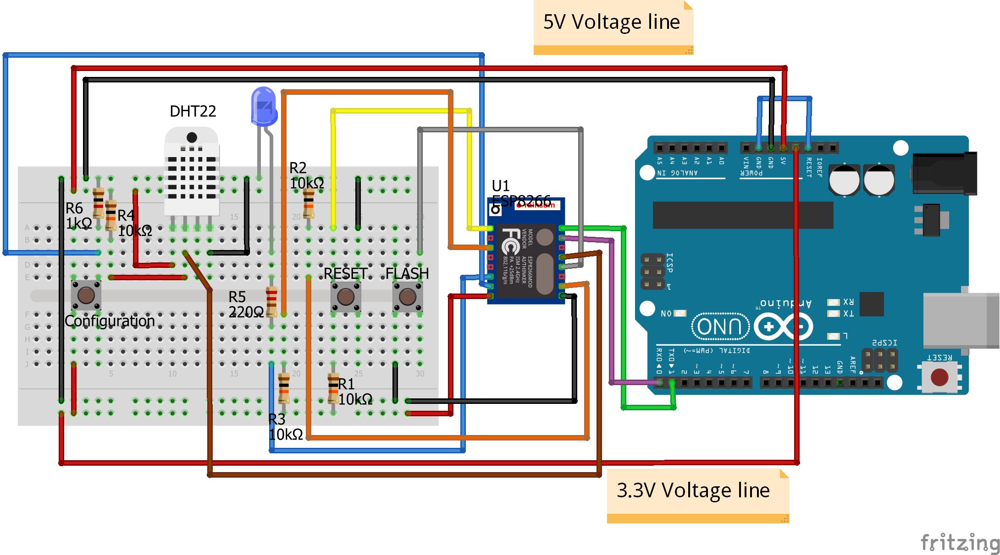

NalkinsCloud-ESP8266
====================

This is an Arduino project, written in C++, to handle ESP8266 chip  
The Project will allow send/receive info from/to sensors, forward it to a MQTT broker, and subscribe to topics

Getting started
---------------
What will you do:
* Build example hardware - Using ESP8266 chip and DHT22 sensor or using LED to simulate a simple switch
* Uploading code to ESP8266 - Use Arduino Uno / Node MCU etc. to upload the code
* Connecting Wi-Fi - Setting up TCP/IP Wi-Fi connection
* Connecting MQTT - Setting up TLS connection to MQTT broker

Pre Installation
----------------
What will you need:
* [Arduino](https://store.arduino.cc/arduino-uno-rev3) board, or any other development board as [Node MCU](http://www.nodemcu.com/index_en.html) or any other you may like
* [ESP8266-12 Chip](https://en.wikipedia.org/wiki/ESP8266), ESP8266-12x model is needed, but once you got the code you could use other chips (Node MCU already have an on board ESP8266)
* [Solderless Plug-in Breadboard](https://en.wikipedia.org/wiki/Breadboard), 830 Pin recommended
* Male-Female and Male-Male [Jumper Wires](https://en.wikipedia.org/wiki/Jump_wire), You will need both types
* [10K, 1K, 220 ohm Resistors](https://en.wikipedia.org/wiki/Resistor), Usually comes in large quantities as they are very cheap, around 2 USD for 100 units on eBay
* 4-pin Tactile Switch, Extremely cheap, eBay prices around 2 USD for 50 units
* DHT22 Temperature Sensor, eBay prices of around 3 USD
* [LED](https://en.wikipedia.org/wiki/Light-emitting_diode), Regular LEDs from eBay cost around 2 USD for 100 Units

Installation
------------

### Connecting electronics - Temperature sensor
* Please note that using Arduino 3.3v as power source for the ESP8266 may cause random behavior. Personally for development I used Arduino as my power source and all is working fine, but again it usually don't provide enough power.  

Connect all components according below image

* Arduino 3.3v pin to LOWER part of the board
* Arduino 5v pin to UPPER part of the board
* Arduino GND to any of the GND Line of the board (Connect both Black GND Lines of the board)
* Arduino GND to Arduino reset pin
* ESP VCC pin to 3.3v (LOWER) part of the board
* ESP GND pin to any GND line on the board
* ESP RX pin to Arduino RX pin
* ESP TX pin to Arduino TX pin
* ESP GPIO00 pin Connected to any GND to "FLASH" the code (button is pushed, explained later)
* ESP GPIO15 pin Connected to any GND with a 10k resistor
* ESP RESET pin Connected to 3.3v (LOWER) with a 10k resistor, and to GND behind a push button, ESP8266 will restart on button press
* ESP CH_PD pin Connected to 3.3v (LOWER) with a 10k resistor
* ESP GPIO12 pin Connected to LED with 220 resistor (LED long leg - Anode, to resistor, LED short pin - Cathode, to GND)
* ESP GPIO13 pin Connected to GND (Pulled low) behind push button, and to 3.3v with 1K resistor

* DHT22 pin no.1 to 5v (UPPER)
* DHT22 pin no.2 to ESP GPIO04 pin and to 5v (UPPER) with a 10k resistor
* DHT22 pin no.4 to any GND

For connecting additional devices, please view docs for examples

### Compiling the code
Download [Arduino IDE](https://www.arduino.cc/en/Main/Software), 
Once installed `git clone https://github.com/ArieLevs/NalkinsCloud-ESP8266.git` and open it with Arduino IDE

#### Setting up configuration files 
Go to `ConfigFile.h`, Change line `const char* fingerprint = ""; // SHA1 - 60 Bytes` With your MQTT Broker certificate SHA1 fingerprint,
Example of the fingerprint structure inside that file,  
In order to get SHA1 fingerprint from .crt file use `openssl x509 -noout -fingerprint -sha1 -inform pem -in [FILE_NAME].crt`  

If you need any additional libraries that are not included with default installation of the Arduino IDE go to `Sketch > Include Library > Manage Libraries`

Press `verify` on the upper left corner to compile the code, make sure code successfully compile

### Uploading code to ESP8266
Add the ESP8266 board, go to `Tools > Boards > Boards Manager`  
Search for `esp8266` and install

Select the just installed board, go to `Tools > Boards > Select 'Generic ESP8266 Module'`

Once all successfully compiled hold "FLASH" (GPIO00) button so it will be grounded,
while pressing "FLASH" button, press "RESET" button to restart the chip, then release all buttons.  
By doing this action you will be able to write code on the ESP chip.

Press upload and wait until the process is done, by opening the monitor `Tools > Serial Monitor` you could see logs being returned to the screen.

### Please note - in order for the device to be able to communicate with MQTT broker, you must complete Mosquitto server installation at [NalkinsCloud](https://github.com/ArieLevs/NalkinsCloud)

Post Installation
-----------------

When the chip cannot connect to the MQTT Broker, or cannot connect to a Wi-Fi network, it will enter a `configuration state`,
On this state the chip will start a `Web Server` and will run as an Access Point, the default SSID is `ESP8266` and default password is `nalkinscloud`.

The device configuration is fully automatic when using [NalkinsCloud Android App](https://github.com/ArieLevs/NalkinsCloud-Android),
but you can also manually configure some of its data.  
The default IP address of the device is `10.0.0.1`, use any smart device to `browse to http://10.0.0.1/` (This is optional process)

Only when the device is in `configuration state` the [Android App](https://github.com/ArieLevs/NalkinsCloud-Android) can connect and configure automatically the device.

In order to setup a working device please refer to [NalkinsCloud-Android](https://github.com/ArieLevs/NalkinsCloud-Android)

Once the device is connected to a Wi-Fi network, and a MQTT broker, it will start sending the broker messages containing `Humidity` and `Temperature`

#### General workflow of setup() function

#### General workflow of main() function

