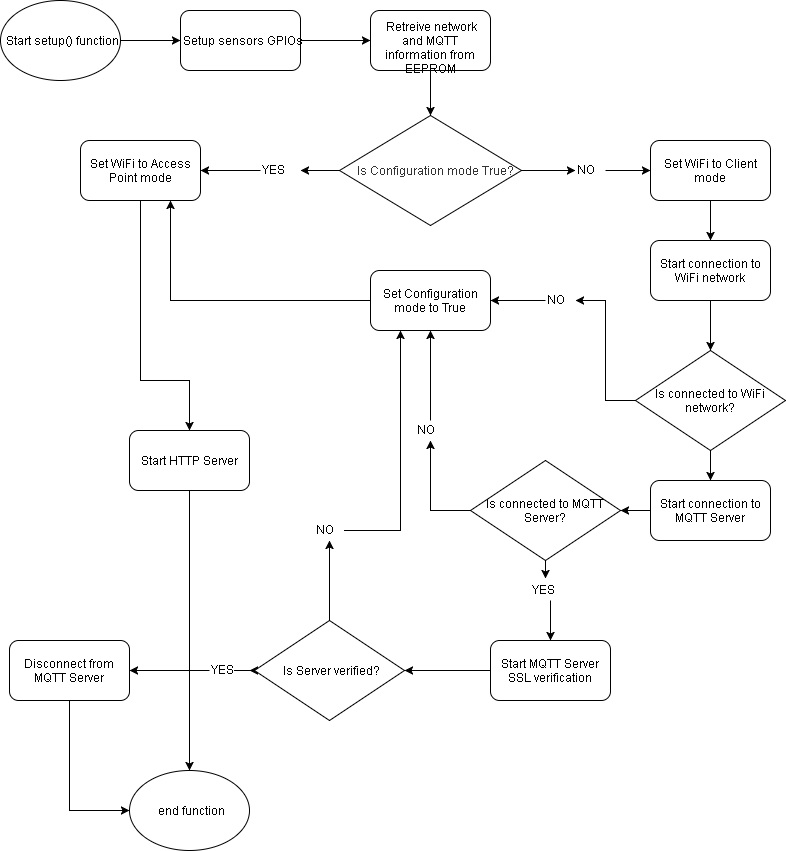

NalkinsCloud-ESP8266
====================

This is an IOT project, written in C++, running on the [ESP8266](https://en.wikipedia.org/wiki/ESP8266) microchip,  
It can also be used on Arduino boards.  
The Project will allow send/receive info from/to sensors, forward it to a MQTT broker.

Setting up project on CLion and PlatformIO
------------------------------------------
Make sure to use Python 3.5+, 
detailed install instructions [here](https://docs.platformio.org/en/latest/core/installation.html#installation)

Install PlatformIO:
```shell script
python3 -c "$(curl -fsSL https://raw.githubusercontent.com/platformio/platformio/master/scripts/get-platformio.py)"
```

Install Shell Commands:
```shell script
# create system-wide symlinks
ln -s ~/.platformio/penv/bin/platformio /usr/local/bin/platformio
ln -s ~/.platformio/penv/bin/pio /usr/local/bin/pio
ln -s ~/.platformio/penv/bin/piodebuggdb /usr/local/bin/piodebuggdb
```

Prepare [Clion IDE with PlatformIO](https://docs.platformio.org/en/latest/integration/ide/clion.html#ide-clion),

Init new project using the [esp8266-12 board](https://docs.platformio.org/en/latest/boards/espressif8266/esp12e.html):
```shell script
platformio init --ide clion --board esp12e
```

Build and Upload project as [instructed here](https://docs.platformio.org/en/latest/integration/ide/clion.html#build-upload)

Post Installation
-----------------

When the chip cannot connect to the MQTT Broker, or cannot connect to a Wi-Fi network, it will enter a `configuration state`,  
On this state the chip will start a `Web Server` and will run as an Access Point, 
the default SSID is `ESP8266` and default password is `nalkinscloud`.

The device configuration is fully automatic when using [NalkinsCloud Android App](https://github.com/ArieLevs/NalkinsCloud-Android),
but you can also manually configure some of its data.  
The default IP address of the device is `10.0.0.1`, 
use any smart device to `browse to http://10.0.0.1/` (This is optional process)

* Only when the device is in `configuration state` the [Android App](https://github.com/ArieLevs/NalkinsCloud-Android) can connect and configure automatically the device.
* In order to setup a working device please refer to [NalkinsCloud-Android](https://github.com/ArieLevs/NalkinsCloud-Android)

Once the device is connected to a Wi-Fi network, and a MQTT broker, it will start sending the broker messages containing `Humidity` and `Temperature`

#### General workflow of setup() function



#### General workflow of main() function


Creating a bit map array
------------------------
* can be later used for ssd1306 oled display

for images of **64x48 pixels**,

select picture in the side of max 64x48,
convert the image to bit map array using http://javl.github.io/image2cpp/,  
select `code output format` to `Arduino code`, save out put part of the code.

Use generated bit map as
```c++
// top left corner X, top left corner Y,
// byte array of bitmap,
// width of bitmap (pixels), height of bitmap (pixels), Color
display.drawBitmap(0, 0, myBitmap, 64, 48, WHITE);
display.display();
```
